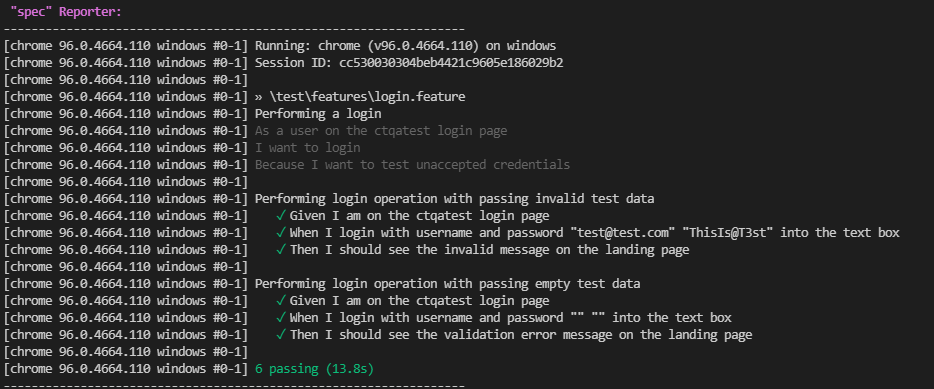
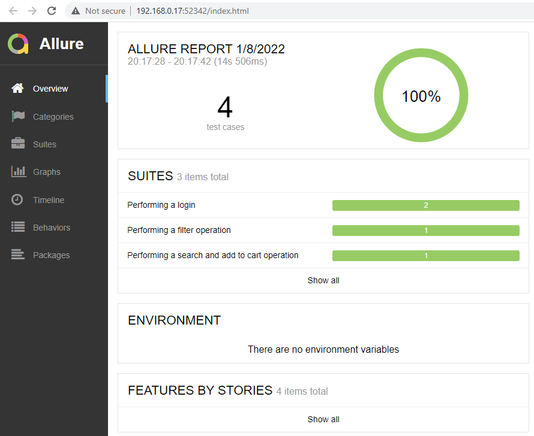

# Webdriver.io - cucumber BDD - Page object model

## Table of contents

- [Introduction](#introduction)
- [How to run test case](#how-to-run-test-case)
- [Report](#Report)
- [Built with](#built-with)
- [Directory tree structure](#directory-tree-structure)
- [Resources](#resources)
- [Author](#author)

## Introduction

This project aims to build a web automation framework using Webdrvierio Framework.

For demo purposes, use the website `http://www.ctqatest.biz/ecom/` and perform the following tasks.

The requirements are as following:

1. Go to the login page and enter the username as test@test.com and password as ThisIs@T3st. Check if there is an error displayed.

2. Go to the login page and leave the username and password field blank and Click on LOGIN button. Check if the validation appears in the input box.

3. Find the search Bar on Top left corner, search by text ‘shirt’. From the search list open the product ‘Slim Fit Dobby Oxford Shirt’. Select the color and size of your choice and add to cart and validate it has successfully been added to the cart.

4. Click on ‘View all Sale’ under Sale menu. The sale page appears with the list of products. Filter with Price $100.00 - $199.99. Validate the filter as been applied correctly.

## How to run test case

- git clone repository
- install node.js from site `https://nodejs.org/en/` if you didn't install previously
- install packages in local `npm install`
- run test call wdio test runner `npm run test`
- if you want to run headless browsers, please uncomment code block under `wdio.conf.ts` in `capabilities` section
```
'goog:chromeOptions': { 
            args: ["--headless", "user-agent=...","--disable-gpu"]
}
```

- npm run script `wdio run wdio.conf.ts` stored in `package.json`
- npm run file `wdio.conf.ts` and run feature files `./test/features/*.feature`
- webdriverio multiremote allows to run multiple automated sessions in a single test

## Report

- after run successfully, spec and allure test report will be generated
- spec test result displayed in console log, for example:


- allure test result is stored under path `Reports/allure-results`
- to generate and view allure report locally, run `npm run allure-report`
- npm run script `allure generate --clean ./Reports/allure-results/ && allure open` stored in `package.json`
- allure report is opened in web browser automatically, for example: 

- `allure-report` folder is created
- snapshot is made and attached when steps are failed using Cucumber `afterTest` hook

## Built with

- Webdriver io
- Cucumber BDD
- Page Object Model uses ES6 styles
- Reporting tool (Spec, Allure)
- typescript assertion library
- Chrome browser execution
- Multiremote

## Directory tree structure

```
allure-report
node_modules
Reports/
    allure-results
test/
    constants/
        constant.ts
    features/
        filter.feature
        login.feature
        seachProduct.feature
    pageobjects/
        cart.page.js
        header.section.js
        login.page.js
        page.js
        product.page.js
        sale.page.js
        search.result.page.js
    stepDefinitions/
        given.ts
        then.ts
        when.ts
package.json
wdio.conf.ts
```

- `wdio.config.ts` set up and execuete tests
- `package.json` store package to be installed and scripts
- `allure-report` store allure test report in html format
- `Reports/allure-result` store test result in format
- `constants.ts` store shared constants for test
- `*.feature*` store test cases
- `Pageobjects` store object repository of each pages
- `stepDefinitions` store cucumber BDD step definition (given, when, then)

## Resources

https://webdriver.io/
https://www.youtube.com/watch?v=H5Nw2mh7AmE#action=share

## Author

- Contributor: Rebecca
- Date: 08/01/2022
